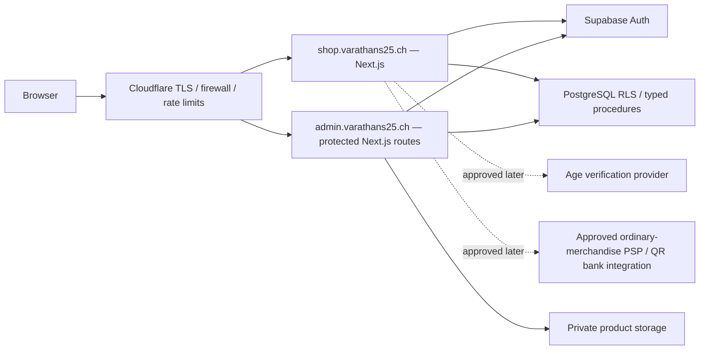

# Production architecture preparation

No public deployment or DNS change is part of this branch. The current GitHub Pages site remains the production website.

The browser talks to same-origin Next.js APIs. Credentials are server-only. No Supabase service credential or bank configuration is included in client bundles. Public catalogue results are explicit projections. Authentication is never delegated solely to the proxy or obscurity of a URL.

`admin.varathans25.ch/` is prepared to rewrite to German administration; locale routes remain available. Browser cookies are host-only, HttpOnly, SameSite=Lax and Secure outside localhost. Shop and admin therefore use separate sign-in sessions, not a broad parent-domain cookie. The host configuration must allow only the approved origins, reject arbitrary forwarded hosts and trust network metadata only from the chosen proxy.

## Environments

| Value | Local review | Hosted staging | Production |
|---|---|---|---|
| Application origin | `http://127.0.0.1:4190` | Owner-approved HTTPS hostname, not yet supplied | `https://shop.varathans25.ch` |
| Admin origin | `/de/admin` on local origin | Separate approved HTTPS hostname | `https://admin.varathans25.ch` |
| Database | Isolated project `varathans25-premium-platform` | Separate hosted Supabase project required | Separate approved production project |
| Age adapter | Deterministic test; prominently labelled | Approved sandbox adapter required | Approved provider required |
| Production writes/live payments/subscriptions/cigar checkout | All false | All false until independent release approval | Not activated by this branch |
| Email | Local Mailpit only | Verified sandbox sender | Approved authenticated sender |

The configuration guard rejects test mode on hosted environments. The database write guard also defaults off. Changing environment flags alone does not activate production writes: a future reviewed release must replace the local-only adapter boundary and complete provider acceptance tests.

## DNS migration plan (not executed)

1. Inventory and export existing DNS records, Cloudflare settings and Pages custom domain configuration.
2. Obtain approved hosting project IDs, hostnames and TLS certificates. Do not move the existing apex or Pages records during staging.
3. Configure shop/admin subdomains, provider callbacks and exact allowed origins in a separate approved change window. Use Cloudflare origin authentication where supported.
4. Validate TLS, redirect allowlists, cookie isolation, CSP, edge rate limits, caching exclusions for accounts/admin/APIs and security headers.
5. Test all existing OpenATG routes before considering a separate migration of public navigation. Maintain the existing Pages release as rollback until explicit approval.

Provider approval, credentials, backup policy, legal terms and product publication are release gates, not toggles to bypass.
